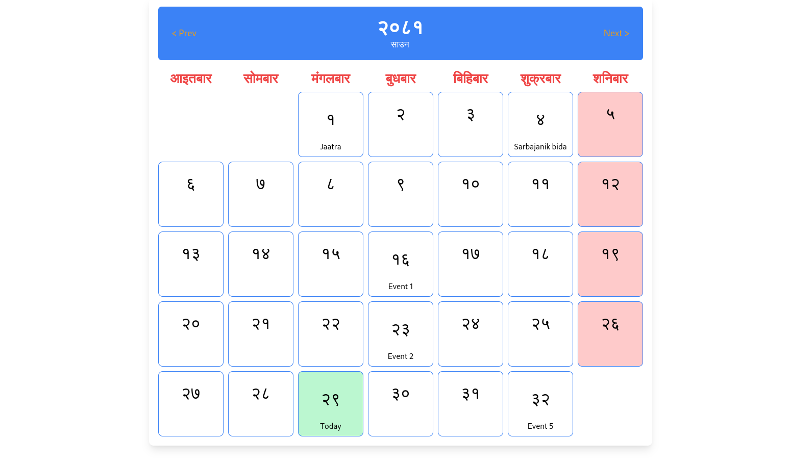

# Calendar Feature Documentation

## Overview

The Calendar feature provides a user-friendly interface for viewing and managing events on a monthly calendar. Users can navigate between months, select specific dates, and add events that will be displayed on the calendar.

## Features

- **Monthly Navigation**: Users can move to the next or previous month to view different dates.
- **Event Management**: Users can select a specific date to open a modal where they can create and save events.
- **Dynamic Event Display**: Events are displayed at the bottom of each day box on the calendar, providing a clear overview of scheduled activities.


## Screenshot




## Installation

1. Clone this repository to your local machine:
   ```bash
   git clone <repository-url>
   ```
2. Navigate to the project directory:
   ```bash
   cd <project-directory>
   ```
3. Install dependencies using Composer:
   ```bash
   composer install
   ```

## Configuration


### Usage

1. In the `Calendar` Livewire component, the following properties and methods are defined:
    - **Properties**:
        - `$date`: The currently displayed date.
        - `$today`: Today's date.
        - `$showModal`: Boolean indicating whether the event modal is visible.
        - `$selectedDate`: The date selected for event creation.
        - `$events`: An array to store events with dates as keys.
        - `$eventName`: The name of the event being created.

    - **Methods**:
        - `mount()`: Initializes the calendar with the current date.
        - `getByDate($date)`: Returns a `MyCalendar` instance for the specified date.
        - `next($date)`: Navigates to the next month.
        - `prev($date)`: Navigates to the previous month.
        - `selectDate($date)`: Opens the modal for creating an event on the selected date.
        - `closeModal()`: Closes the event modal.
        - `saveEvent()`: Validates and saves the event for the selected date.
        - `render()`: Renders the calendar view with events.

2. The modal for adding events can be styled and customized as per your requirements. Ensure that the modal is properly linked to the `showModal` property to toggle its visibility.

## Example Calendar Layout

The calendar displays days in a grid format, with each day represented as a square box. The day number is centered, and any associated events are displayed at the bottom of each box. Users can click on a date to open the event creation modal.

## Contributing

If you'd like to contribute to this project, please fork the repository and submit a pull request with your changes.

## License

This project is licensed under the MIT License - see the [LICENSE](LICENSE) file for details.

